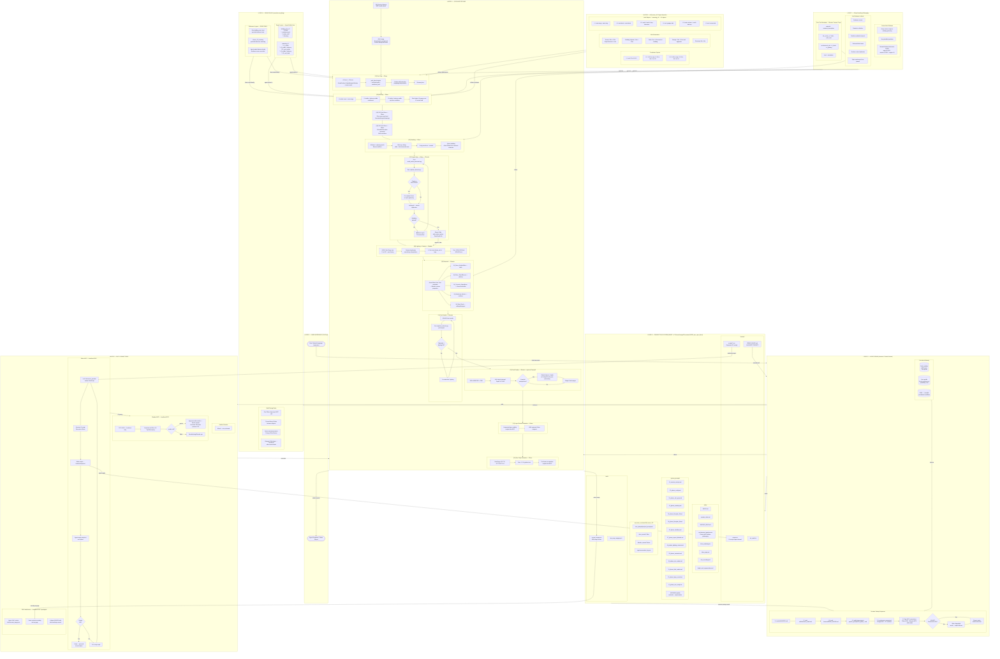

# AEC CPTX Pipeline — Flow Diagram
*Generated: May 2026 | Project: cliff_house_02*
*Programmer's reference — maps the full system from user input to final render*

---

```mermaid
flowchart TD

%% ─────────────────────────────────────────────
%%  SUBGRAPH: USER INTERFACE
%% ─────────────────────────────────────────────
subgraph UI["LAYER 1 — USER INTERFACE (TUI Chat)"]
    U1([User: Natural Language Instruction])
    U2([Agent Response / Status Report])
end

%% ─────────────────────────────────────────────
%%  SUBGRAPH: AGENT BRAIN
%% ─────────────────────────────────────────────
subgraph AGENT["LAYER 2 — AGENT BRAIN (Hermes / Claude Sonnet)"]
    direction TB

    subgraph STARTUP["Session Startup Sequence"]
        S1[1. Load skills/INDEX.md]
        S2[2. Load skills/session_state.md]
        S3[3. Load hermes/DEMO_RULES.md]
        S4[4. Load phase prompt\nsystem_prompts/0N_phase_*.md]
        S5[5. Load project_prompt.md\nDesign brief — 12 sections]
        S6[6. Ping MCP connections\nRhino:3001 · Blender:9876 · OBS:4455]
        S7{All MCP\nConnections OK?}
        S8[Report status\nAwait instruction]
        S9[Warn: degraded\nmode — report failures]

        S1 --> S2 --> S3 --> S4 --> S5 --> S6 --> S7
        S7 -->|Yes| S8
        S7 -->|No| S9
        S9 --> S8
    end

    subgraph MEM["Persistent Memory"]
        M1[(Path variables\nMCP ports\nTool quirks)]
        M2[(User profile\nSean's preferences\nportability rules)]
        M3[(Skills — reusable\nprocedural workflows)]
    end
end

%% ─────────────────────────────────────────────
%%  SUBGRAPH: FILE SYSTEM
%% ─────────────────────────────────────────────
subgraph FS["LAYER 3 — PROJECT FILE SYSTEM  (ROOT = C:\\Users\\swags\\Documents\\2026_aec_cptx_demo)"]
    direction LR

    subgraph SKILLS["skills/"]
        F1[INDEX.md]
        F2[session_state.md]
        F3[BACKUP_RULE.md]
        F4[architectural_pipeline.md\nDerive-don't-redraw philosophy]
        F5[rhino_modeling.md]
        F6[rhino_prep.md]
        F7[obs_recording.md]
        F8[depth_and_segmentation.md]
    end

    subgraph SYSPR["system_prompts/"]
        SP0[00_session_startup.md]
        SP1[01_phase_config.md]
        SP2[02_phase_site_prep.md]
        SP3[03_phase_massing.md]
        SP4[04_phase_floorplan_2d.md]
        SP5[05_phase_floorplan_3d.md]
        SP6[06_phase_detailing.md]
        SP7[07_phase_export_blender.md]
        SP8[08_phase_lighting_camera.md]
        SP9[09_phase_materials.md]
        SP10[10_phase_test_render.md]
        SP11[11_phase_final_render.md]
        SP12[12_phase_layer_reveal.md]
        SP13[13_phase_sun_study.md]
        SPAPP[APPENDIX pitfalls\nmaterials · segmentation]
    end

    subgraph HERMES_DIR["hermes/"]
        H1[DEMO_RULES.md\n⚠ HIGHEST PRIORITY]
        H2[output.txt\nC# script output channel]
        H3[ref_audit.txt]
        H4[scripts/*.csx\nGenerated C# scripts]
    end

    subgraph PROJECT["aa_demo_versions/cliff_house_02/"]
        P1[user_prompts/project_prompt.md]
        P2[rhino_assets/*.3dm]
        P3[blender_assets/*.blend]
        P4[logs/conversation_log.md]
    end

    subgraph TOOLS_DIR["tools/"]
        T1[current_stage.json\nOBS stage tracker]
        T2[obs_mcp_wrapper.ps1]
    end
end

%% ─────────────────────────────────────────────
%%  SUBGRAPH: DEMO RULES
%% ─────────────────────────────────────────────
subgraph RULES["LAYER 4 — DEMO RULES (override everything)"]
    direction LR

    subgraph REF_LAYERS["Reference Layers — READ ONLY"]
        RL1[Site::building_site_fixed\npre-built reference site]
        RL2[House_02_massing\npre-built reference massing]
        RL3[Agent reads bboxes silently\nAudience never sees this]
    end

    subgraph TGT_LAYERS["Target Layers — Agent Builds Here"]
        TL1[building_site_v3\n└ terrain\n└ combined_pad\n└ curtain_wall\n└ driveway]
        TL2[massing_v3\n└ L1_solids\n└ L2_solids + balcony\n└ L2_roof_solids\n└ L3_solids + balcony\n└ L3_roof_slab]
    end

    subgraph PACING["Build Pacing Rules"]
        BP1[One Rhino object per MCP call]
        BP2[Thread.Sleep 300ms between objects]
        BP3[Never announce pauses\nPacing IS the illusion]
        BP4[Viewport: Wireframe → Rendered\nafter terrain lands]
    end
end

%% ─────────────────────────────────────────────
%%  SUBGRAPH: MCP CONNECTIONS
%% ─────────────────────────────────────────────
subgraph MCP["LAYER 5 — MCP CONNECTIONS"]
    direction TB

    subgraph RHINO_MCP["Rhino MCP — localhost:3001"]
        RM1[tool: rhinoceros_operator\naction: RunScript]
        RM2[Receive C# script\nExecute in Rhino]
        RM3[Write output → hermes/output.txt]
        RM4[Agent reads output.txt\nvia Python]
        RM5{Output\nOK?}
        RM6[Verify → proceed\nto next object]
        RM7[Fix / retry script]
        RM1 --> RM2 --> RM3 --> RM4 --> RM5
        RM5 -->|Yes| RM6
        RM5 -->|No| RM7
        RM7 --> RM1
    end

    subgraph BLENDER_MCP["Blender MCP — localhost:9876"]
        BM1[TCP JSON — localhost only]
        BM2[Reached via Rhino C# TcpClient proxy]
        BM3{render call?}
        BM4[bpy.ops.render.render — blocks socket\nUse timer OR Sean presses F12]
        BM5[Non-blocking Blender ops]
        BM1 --> BM2 --> BM3
        BM3 -->|render| BM4
        BM3 -->|other| BM5
    end

    subgraph OBS_MCP["OBS WebSocket — localhost:4455 / pw:bigfish"]
        OM1[Agent ONLY writes\ntools/current_stage.json]
        OM2[Sean controls recording\nvia tray app]
        OM3[⚠ Agent NEVER calls\nobs-start/stop-record]
    end

    subgraph RESOLVE["DaVinci Resolve"]
        DV1[Wired — not yet tested]
    end
end

%% ─────────────────────────────────────────────
%%  SUBGRAPH: 13-PHASE PIPELINE
%% ─────────────────────────────────────────────
subgraph PIPELINE["LAYER 6 — 13-PHASE PIPELINE"]
    direction TB

    PH00["[00] Session Startup\nMCP health check"]
    PH01["[01] Config\nRead project_prompt.md\nConfirm design decisions"]

    subgraph PH02_BOX["[02] Site Prep — Rhino"]
        PH02A[uCurves + vCurves\n→ NurbsSurface.CreateNetworkSurface\n→ terrain mesh]
        PH02B[pad_plan footprint\n→ extruded solid → combined_pad]
        PH02C[Curtain wall extrusion\nwrapping pad perimeter]
        PH02D[Driveway box]
        PH02A --> PH02B --> PH02C --> PH02D
    end

    subgraph PH03_BOX["[03] Massing — Rhino"]
        PH03A[L1 solids: east + west wings]
        PH03B[L2 solids + balcony solids\ncantilevers]
        PH03C[L3 solids + balcony solids\ntop floor cantilever]
        PH03D[Roof slabs: L2 garage roof\nL3 crown slab]
        PH03A --> PH03B --> PH03C --> PH03D
    end

    PH04["[04] 2D Floor Plans — Rhino\nPlan curves per level\nAnnotated layout drawings"]
    PH05["[05] 3D Floor Plans — Rhino\nExtruded floor plan geometry\nRoom volumes"]

    subgraph PH06_BOX["[06] Detailing — Rhino"]
        PH06A[Windows + glazing panels\nBronze mullions]
        PH06B[Balcony railings\ncable · thin horizontal steel]
        PH06C[Entry pivot door + reveals]
        PH06D[Stone cladding\noffset 25mm from concrete substrate]
        PH06A --> PH06B --> PH06C --> PH06D
    end

    subgraph PH07_BOX["[07] Export Gate — Rhino → Blender"]
        PH07A[Run audit_active_document.py]
        PH07B[Run coplanar_detector.py]
        PH07C{Coplanar\nfaces found?}
        PH07D[Fix coplanar faces\nor reject geometry]
        PH07E[SelDupAll → delete duplicates]
        PH07F{Validation\npassed?}
        PH07G[Export .3dm\nwith render meshes\nSaveSmall=No]
        PH07H[⛔ Block export\nFix issues first]
        PH07A --> PH07B --> PH07C
        PH07C -->|Yes| PH07D --> PH07E
        PH07C -->|No| PH07E
        PH07E --> PH07F
        PH07F -->|Yes| PH07G
        PH07F -->|No| PH07H
        PH07H --> PH07A
    end

    subgraph PH08_BOX["[08] Lighting + Camera — Blender"]
        PH08A[HDRI: San Diego sun\nZ-rot 90° = west facing]
        PH08B[Camera keyframes\nsmoothstep interpolation]
        PH08C[⚠ No scene.frame_set in loop]
        PH08D[Res: 1920×1080 final\n960×540 test]
        PH08A --> PH08B --> PH08C --> PH08D
    end

    subgraph PH09_BOX["[09] Materials — Blender"]
        PH09A[Read Rhino User Text metadata\n→ Blender custom properties]
        PH09B[M_Stone_AshlarWhite — walls]
        PH09C[M_Glass_TintedBronze — glazing]
        PH09D[M_Concrete_WarmBone — floors/roof/soffits]
        PH09E[M_Aluminum_Bronze — mullions]
        PH09F[M_Steel_Dark — railings/stringers]
        PH09A --> PH09B & PH09C & PH09D & PH09E & PH09F
    end

    subgraph PH10_BOX["[10] Test Render — Blender"]
        PH10A[960×540 test render]
        PH10B[Run coplanar_detector.py post-import]
        PH10C{Materials +\nlighting OK?}
        PH10D[Fix materials / lighting]
        PH10A --> PH10B --> PH10C
        PH10C -->|No| PH10D --> PH10A
    end

    subgraph PH11_BOX["[11] Final Render — Blender + optional ComfyUI"]
        PH11A[1920×1080 EXR + PNG]
        PH11B[EXR depth channel: Depth.V FLOAT]
        PH11C{ComfyUI\npost-process?}
        PH11D[Submit frames + depth\nto ComfyUI for AI post-processing]
        PH11E[Output: final images]
        PH11A --> PH11B --> PH11C
        PH11C -->|Yes| PH11D --> PH11E
        PH11C -->|No| PH11E
    end

    subgraph PH12_BOX["[12] Layer Reveal Animation — Rhino"]
        PH12A[Sequential layer visibility\nscripted via MCP]
        PH12B[OBS captures Rhino viewport]
        PH12A --> PH12B
    end

    subgraph PH13_BOX["[13] Sun Study Animation — Rhino"]
        PH13A[San Diego: 32.7°N -117.2°W TZ=-8]
        PH13B[Time: 17:30 golden hour]
        PH13C[Per-frame sun position\nscripted via MCP]
        PH13A --> PH13B --> PH13C
    end

    PH00 --> PH01 --> PH02_BOX --> PH03_BOX --> PH04 --> PH05 --> PH06_BOX --> PH07_BOX --> PH08_BOX --> PH09_BOX --> PH10_BOX
    PH10C -->|Yes| PH11_BOX --> PH12_BOX --> PH13_BOX
end

%% ─────────────────────────────────────────────
%%  SUBGRAPH: RHINO MODELING PHILOSOPHY
%% ─────────────────────────────────────────────
subgraph PHILOSOPHY["LAYER 7 — Rhino Modeling Philosophy"]
    direction LR

    subgraph DERIVE["Derive-Don't-Redraw"]
        PH_D1[Every vertex snaps to existing geometry]
        PH_D2[No eyeballed positions]
        PH_D3[NetworkSurface tolerances FIXED\nedge=0.0001 · interior=0.0001 · angle=1.0]
    end

    subgraph ANTIPATTERNS["Anti-Patterns to Avoid"]
        AP1[Coplanar corners]
        AP2[Painted-on finishes]
        AP3[Double-modeled elements]
        AP4[Slab-wall flush faces]
        AP5[Boolean union duplicates]
        AP6[Triple-stacking at floor planes]
    end

    subgraph METADATA["User Text Metadata → Blender Custom Props"]
        MD1[material · material_description]
        MD2[tile_scale_m · finish · color_hint]
        MD3[architectural_role · is_finish · is_glazing]
        MD4[level · orientation]
    end
end

%% ─────────────────────────────────────────────
%%  SUBGRAPH: PROJECT SPECIFICS
%% ─────────────────────────────────────────────
subgraph PROJECT_SPEC["LAYER 8 — cliff_house_02 Project Specifics"]
    direction LR

    subgraph COORDS["Coordinate System"]
        C1[L1: real XY at Z=0.5]
        C2[L2: X+25 in map / X-25 in 3D / Z+3.75]
        C3[L3: X+50 in map / X-50 in 3D / Z+7.5]
    end

    subgraph SITE_DIMS["Site Dimensions"]
        SD1[Terrain: 40m × 42m\nDrops 8m west→east]
        SD2[Building footprint: 12m × 20m]
        SD3[Patio: 11m × 31m west of building]
        SD4[Garage: 12m × 11m east approach]
        SD5[Driveway: 8m × 9m]
    end

    subgraph BUILT["Built Objects — massing_v3 — 11 objects"]
        OB1[L1: east wing + west wing]
        OB2[L2: east block + west block]
        OB3[L2: south / north / step balconies]
        OB4[L2 roof: garage slab]
        OB5[L3: main volume + south balcony]
        OB6[L3 roof: crown slab]
    end
end

%% ─────────────────────────────────────────────
%%  TOP-LEVEL DATA FLOW CONNECTIONS
%% ─────────────────────────────────────────────
U1 -->|chat instruction| AGENT
AGENT -->|drives| PIPELINE
AGENT -->|reads| FS
AGENT -->|enforces| RULES
AGENT -->|calls| MCP
MCP -->|executes| PIPELINE
FS -->|session startup reads| STARTUP
H1 -->|overrides all| AGENT
PIPELINE -->|writes stage| T1
T1 -->|read by tray app| OM2
RHINO_MCP -->|C# proxy| BLENDER_MCP
PH07G -->|imports .3dm| PH08_BOX
PIPELINE -->|status reports| U2
MEM -->|informs| STARTUP
REF_LAYERS -->|bbox read silently| PH02_BOX
REF_LAYERS -->|bbox read silently| PH03_BOX
TGT_LAYERS -->|agent writes to| PH02_BOX
TGT_LAYERS -->|agent writes to| PH03_BOX
METADATA -->|drives| PH09_BOX
PHILOSOPHY -->|governs| PH02_BOX
PHILOSOPHY -->|governs| PH03_BOX
PHILOSOPHY -->|governs| PH06_BOX
PROJECT_SPEC -->|defines dimensions| PH02_BOX
PROJECT_SPEC -->|defines volumes| PH03_BOX
H4 -->|written by agent| RM1
RM3 -->|agent reads| H2
```
